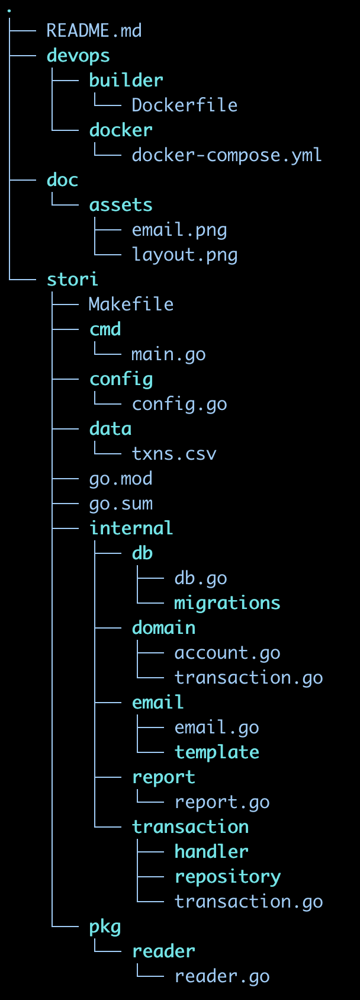

# Stori

Sending the transactions summary by email

# About project
- We're using a modular application.
- Dependency-injection, more info [here](https://github.com/alecthomas/inject).
- [GORM](https://gorm.io/docs/) ORM library for saving the data.
- [Goose](https://pressly.github.io/goose/) library to manage the migrations.

# Layout


# Environment variables
Read environment variables with [viper](github.com/spf13/viper). Now, are located at `devops/docker/.env`.

| Variable  | Type  | Description  | Default  |
|---|---|---|---|
| DSN_DB | string | Gorm source string  | ## change me ## |
| SG_KEY |  string | Api key for Sendgrid platform | ## change me ## |
| SG_SENDER | string | Email address as Sender identity. | ## change me ## |
| CSV_FILE | string | CSV file path | `data/txns.csv` |

# Requirements

* [docker](https://www.docker.com/)
* [docker-compose](https://docs.docker.com/compose/)

# Run application using Docker

**Note**: If you want to receive the email in your inbox please edit the `data/txns.csv` replacing the `account` and `email` in this case `Braulio` and `brauliodev@gmail.com` for what you want.

```shell
# Clone repo
$ git clone git@github.com:BraulioAguilarDev/stori-svc.git

# Go to stori directory
$ cd stori-svc/stori

# Copy the .env file then replace all ## change me ## at /devops/docker/.env
$ make env

# Building docker image "stori:latest" with following command
$ make docker

# Create and run the containers
$ make dc-up

# Print logs
$ make logs

# Remove all
$ make dc-down
```

# Evidence

Email info


